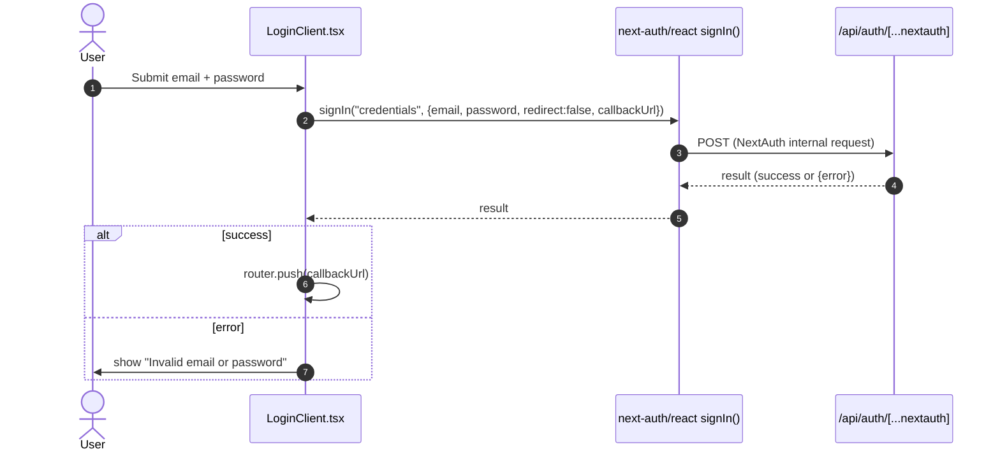

# Sequence: Credentials Sign-In

## Context

This diagram shows the interaction that occurs when a user submits the sign-in form on the `/login` page, grounded in `src/app/login/LoginClient.tsx`, `src/app/login/page.tsx`, and `src/app/api/auth/[...nextauth]/route.ts`.

**Trigger:** The user submits the sign-in form, invoking the `onSubmit` handler in `LoginClient.tsx`.

## Participants

| Participant | Type | Description |
|-------------|------|-------------|
| User | Actor | The person entering email and password on `/login`. |
| LoginClient | Client component | `src/app/login/LoginClient.tsx`, a `"use client"` React component holding form state. |
| NextAuth client (`signIn`) | Library call | `signIn("credentials", { email, password, redirect: false, callbackUrl })` from `next-auth/react`. |
| NextAuth route handler | Service | `src/app/api/auth/[...nextauth]/route.ts`, delegating to `NextAuth(authOptions)`. |
| Credential verification | Callback (`authorize` in `src/lib/auth.ts`) | The `authorize` callback normalizes the submitted email (`.toLowerCase().trim()`), looks up the user via `prisma.user.findUnique({ where: { email } })`, and verifies the password with `bcrypt.compare(password, user.password)`. It returns `null` if the email/password is missing, no matching user exists, or the hash comparison fails; otherwise it returns `{ id: user.id, email: user.email, name: user.name ?? undefined }`. |

## Sequence Diagram

## Flow Description

### 1. Form submission (LoginClient.tsx)

The user fills the email and password fields (both `required`, `type="email"` / `type="password"`) and submits the form. `onSubmit` calls `e.preventDefault()`, sets `loading` true, and clears any prior error.

### 2. Credential exchange (signIn call)

`LoginClient` calls `signIn("credentials", { email, password, redirect: false, callbackUrl })`, where `callbackUrl` is read from the `callbackUrl` search-param (`sp.get("callbackUrl")`) and defaults to `"/plans"` if absent. This call is **not** wrapped in a `try/catch` in the reviewed code, unlike the analogous call in `register/page.tsx`. Because the call is not wrapped in `try/catch`, a thrown/network-level failure propagates as an unhandled promise rejection out of `onSubmit`: none of the statements after the `await signIn(...)` call — `setLoading(false)`, the `res?.error` check, and `router.push(callbackUrl)` — execute. The UI is left with `loading` still `true` (submit button disabled, showing "Signing in..."), no error message is shown, and no navigation occurs.

### 3. Result handling

If `res?.error` is truthy, `LoginClient` sets the error state to the literal string `"Invalid email or password"` and returns (no navigation). Otherwise, it calls `router.push(callbackUrl)`.

## Error Scenarios

| Failure Point | Handling |
|---------------|----------|
| `signIn` resolves with `res.error` set | `LoginClient` displays "Invalid email or password"; user remains on `/login`. |
| `signIn` throws / network failure | No `try/catch` present around this call, so the exception becomes an unhandled promise rejection from `onSubmit`; `setLoading(false)` never runs, leaving the UI stuck with `loading` true (button disabled, "Signing in..." label), no error message, and no navigation. |
| Internal credential-verification failure inside `authOptions` | When `authorize` in `authOptions` (`src/lib/auth.ts`) fails verification — missing email/password, no matching `user` row, or `bcrypt.compare` returning `false` — it returns `null`. NextAuth's `CredentialsProvider` treats a `null` return as a failed sign-in, so the client-side `signIn("credentials", ...)` call (invoked with `redirect: false`) resolves with `res.error` set, following the same path as the first row: `LoginClient` displays "Invalid email or password" and the user remains on `/login`. |
