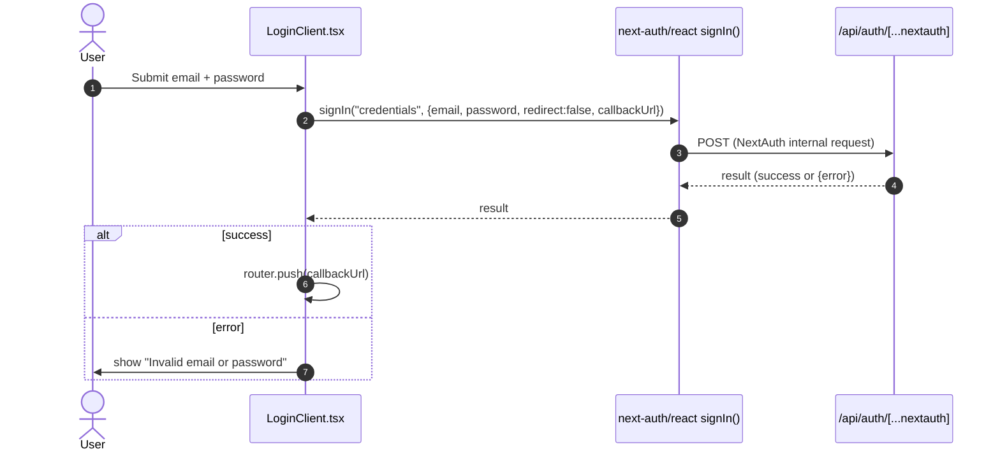

# Sequence: Credentials Sign-In

## Context

This diagram shows the interaction that occurs when a user submits the sign-in form on the `/login` page, grounded in `src/app/login/LoginClient.tsx`, `src/app/login/page.tsx`, and `src/app/api/auth/[...nextauth]/route.ts`.

**Trigger:** The user submits the sign-in form, invoking the `onSubmit` handler in `LoginClient.tsx`.

## Participants

| Participant | Type | Description |
|-------------|------|-------------|
| User | Actor | The person entering email and password on `/login`. |
| LoginClient | Client component | `src/app/login/LoginClient.tsx`, a `"use client"` React component holding form state. |
| NextAuth client (`signIn`) | Library call | `signIn("credentials", { email, password, redirect: false, callbackUrl })` from `next-auth/react`. |
| NextAuth route handler | Service | `src/app/api/auth/[...nextauth]/route.ts`, delegating to `NextAuth(authOptions)`. |
| Credential verification | [NEEDS CLARIFICATION] | The logic that actually checks the submitted password against the stored hash lives inside `authOptions` (imported from `@/lib/auth`), which is outside this dispatch's permitted read set. Its behavior (e.g. whether it calls `bcrypt.compare` against the `persistence` module's `User` row) is not confirmed here. |

## Sequence Diagram

## Flow Description

### 1. Form submission (LoginClient.tsx)

The user fills the email and password fields (both `required`, `type="email"` / `type="password"`) and submits the form. `onSubmit` calls `e.preventDefault()`, sets `loading` true, and clears any prior error.

### 2. Credential exchange (signIn call)

`LoginClient` calls `signIn("credentials", { email, password, redirect: false, callbackUrl })`, where `callbackUrl` is read from the `callbackUrl` search-param (`sp.get("callbackUrl")`) and defaults to `"/plans"` if absent. This call is **not** wrapped in a `try/catch` in the reviewed code, unlike the analogous call in `register/page.tsx`. [NEEDS CLARIFICATION] Behavior on a thrown/network-level failure (as opposed to a `res.error` response) is not established.

### 3. Result handling

If `res?.error` is truthy, `LoginClient` sets the error state to the literal string `"Invalid email or password"` and returns (no navigation). Otherwise, it calls `router.push(callbackUrl)`.

## Error Scenarios

| Failure Point | Handling |
|---------------|----------|
| `signIn` resolves with `res.error` set | `LoginClient` displays "Invalid email or password"; user remains on `/login`. |
| `signIn` throws / network failure | [NEEDS CLARIFICATION] No `try/catch` present around this call in the reviewed code; resulting UI behavior is unconfirmed. |
| Internal credential-verification failure inside `authOptions` | [NEEDS CLARIFICATION] Not visible in this dispatch's permitted read set. |
