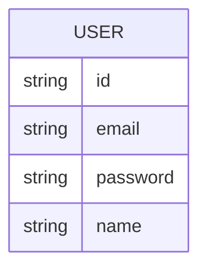

# Data Model: Auth

## Overview

**Database:** PostgreSQL. The code accesses a `prisma` client imported from `@/lib/db`, configured in `src/lib/db.ts` with the `@prisma/adapter-pg` driver adapter (`new PrismaPg({ connectionString })`, where `connectionString` is `process.env.DATABASE_URL`), confirming Prisma ORM usage against a PostgreSQL database engine.

**Schema:** [NEEDS CLARIFICATION] Not visible in the reviewed files.

## Entity-Relationship Diagram

Only the fields directly observed in `src/app/api/auth/register/route.ts` and `src/types/next-auth.d.ts` can be shown; other columns are unconfirmed.

[NEEDS CLARIFICATION] Column types (e.g. whether `id` is a UUID or auto-increment integer), nullability, and any additional columns (timestamps, etc.) are not established by the reviewed files.

## Tables

### User (Prisma model, accessed as `prisma.user`)

**Purpose:** Stores account credentials used for sign-in.

| Column | Type | Nullable | Description |
|--------|------|----------|-------------|
| id | string | NO | Selected in the response of `POST /api/auth/register` (`select: { id: true, ... }`); underlying type not shown. |
| email | string | NO | Looked up via `prisma.user.findUnique({ where: { email } })`; stored lowercased and trimmed by the register route. |
| password | string | NO | Stores a bcrypt hash (`bcrypt.hash(password, 12)`), never the plaintext password. |
| name | string | YES | Optional (`z.string().min(1).max(80).optional()` in the register route's Zod schema). |
| created_at | [NEEDS CLARIFICATION] | — | Not referenced by any file in this dispatch's inputs. |
| updated_at | [NEEDS CLARIFICATION] | — | Not referenced by any file in this dispatch's inputs. |

**Key Indexes:**

| Columns | Purpose |
|---------|---------|
| email | Email uniqueness is checked at the application level (`findUnique` before `create`) but a database-level unique index/constraint is not confirmed by the reviewed files. |

**Foreign Keys:**

| Column | References | On Delete |
|--------|------------|-----------|
| [NEEDS CLARIFICATION] | — | — |

---

## Domain Mapping

| Domain Entity | Table | Notes |
|---------------|-------|-------|
| User | User (Prisma model `user`) | Accessor name `prisma.user` strongly suggests a Prisma model literally named `User`, but the schema file itself was not in scope for this dispatch. |

## Data Retention

| Table | Retention | Strategy |
|-------|-----------|----------|
| User | [NEEDS CLARIFICATION] | No retention or deletion logic for user accounts was found in the reviewed files. |
