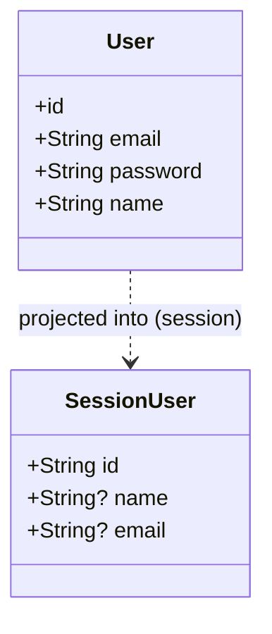

# Domain Model: Auth

## Overview

The auth domain is centered on one persisted entity, `User`, and one derived, non-persisted projection of it exposed through an authenticated session (`Session.user`). Both are grounded directly in the reviewed files: `src/app/api/auth/register/route.ts` for `User`'s observable fields, and `src/types/next-auth.d.ts` for the session projection.

## Class Diagram



The `id` attribute's concrete type is `string`: NextAuth's `CredentialsProvider.authorize` callback in `src/lib/auth.ts` returns `{ id: user.id, ... }`, which is assigned to `token.sub` in the `jwt` callback and then to `session.user.id`, declared as `string` in the `next-auth` module augmentation in `src/types/next-auth.d.ts`.

## Entities

### User (Aggregate Root)

**Purpose:** Represents a registered account holder for finance-planner. Created by `POST /api/auth/register` and read during sign-in.

**Key Attributes:**

| Attribute | Type | Description |
|-----------|------|-------------|
| id | string | Unique identifier. |
| email | string | Lowercased and trimmed before lookup/creation (`parsed.data.email.toLowerCase().trim()`). |
| password | string | Stores a bcrypt hash with cost factor 12 (`bcrypt.hash(parsed.data.password, 12)`); never the plaintext password. |
| name | string (optional) | 1–80 characters when provided (`z.string().min(1).max(80).optional()`). |

**Invariants (rules that must always hold):**

- A password is never stored in plaintext — only a bcrypt hash (cost factor 12) is persisted.
- Registration is rejected with a 409 response if a `User` with the same (lowercased/trimmed) email already exists, per the `findUnique` check in `POST /api/auth/register`. [NEEDS CLARIFICATION] Whether this uniqueness is *also* enforced by a database-level constraint (vs. only this application-level check) is not established, since the schema file is out of this dispatch's scope.
- Password length must be at least 8 characters, enforced server-side by the Zod schema in `POST /api/auth/register` (and mirrored client-side via the `minLength={8}` HTML attribute in `src/app/register/page.tsx`).

**Relationships:**

[NEEDS CLARIFICATION] Relationships from `User` to other domain entities (e.g. a `Plan` owned by a user) are owned by other modules whose files are outside this dispatch's permitted read set.

---

### SessionUser (Value Object / projection, not persisted)

**Purpose:** The shape of `session.user` as declared via NextAuth module augmentation in `src/types/next-auth.d.ts`. It represents the authenticated identity made available to the rest of the app after sign-in, not a database row.

**Parent:** User (derived from)

**Key Attributes:**

| Attribute | Type | Description |
|-----------|------|-------------|
| id | string | Required. |
| name | string \| null (optional) | Optional. |
| email | string \| null (optional) | Optional. |

**Lifecycle:**
- Created when: a session is established after a successful `signIn("credentials", ...)` call.
- Deleted when: the user explicitly signs out via `GET /logout` (`src/app/logout/route.ts`), which redirects to NextAuth's built-in `/api/auth/signout` endpoint to clear the session cookie, or the JWT session cookie naturally expires (session strategy is `jwt`, per `session: { strategy: "jwt" }` in `src/lib/auth.ts`, with no explicit `maxAge` override shown).

## Value Objects

### SessionUser

```
SessionUser {
  id: string
  name?: string | null
  email?: string | null
}
```

**Invariants:**
- `id` is always present per the `next-auth` module augmentation in `src/types/next-auth.d.ts`.

## Domain Events

| Event | Triggered When | Key Data |
|-------|----------------|----------|
| — | No explicit domain-event emission (e.g. a pub/sub call or event log write) was found in any of the reviewed files (`src/app/api/auth/register/route.ts`, `src/app/api/auth/[...nextauth]/route.ts`, `src/lib/auth.ts`). | — |
