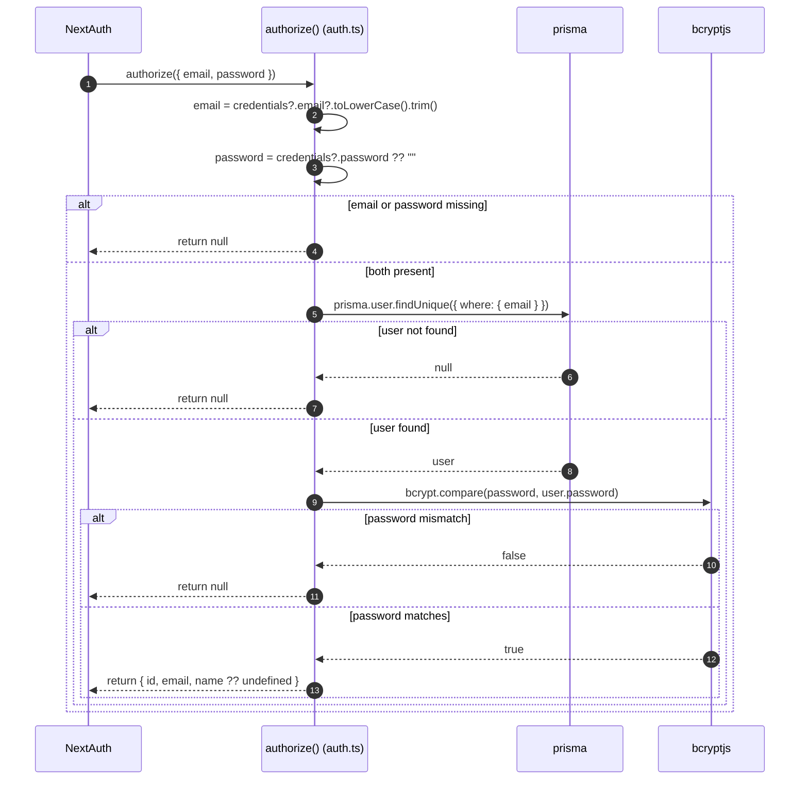

# Behavior: Credentials Authorization

## Context

Describes the `authorize()` callback inside `authOptions.providers[0]` (`CredentialsProvider`) in `src/lib/auth.ts`, invoked by NextAuth when a user submits the credentials sign-in form.

**Trigger:** NextAuth's credentials sign-in flow calling `authorize(credentials)` with `{ email, password }`.

## Participants

| Participant | Type | Description |
|-------------|------|--------------|
| NextAuth | Service | Framework invoking `authorize()` |
| authorize() | Service | `src/lib/auth.ts` callback |
| prisma | Service | Shared Prisma client (`src/lib/db.ts`) |
| bcryptjs | Service | Password hash comparison |

## Sequence Diagram

## Flow Description

### 1. Input normalization (Steps 2-3)

Email is lower-cased and trimmed; a missing password defaults to an empty string.

### 2. Presence guard (Step 4)

If either `email` or `password` is falsy, `authorize()` returns `null` immediately without querying the database.

### 3. User lookup and password check (Steps 5-11)

The user is looked up by exact (post-normalization) email match. If found, the submitted password is compared against the stored `user.password` hash with `bcrypt.compare`. Only a `true` result returns a user object (`id`, `email`, `name ?? undefined`) to NextAuth; every other path returns `null`.

## Error Scenarios

| Failure Point | Handling |
|----------------|----------|
| Missing email/password | Returns `null` (NextAuth treats this as sign-in failure) |
| Unknown email | Returns `null` - the same outward result as a wrong password (no user-enumeration signal) |
| Wrong password | Returns `null` |
| Database error during `findUnique` | [NEEDS CLARIFICATION] No try/catch is present in `authorize()`; propagation behavior is not confirmed in this module's inputs. |
