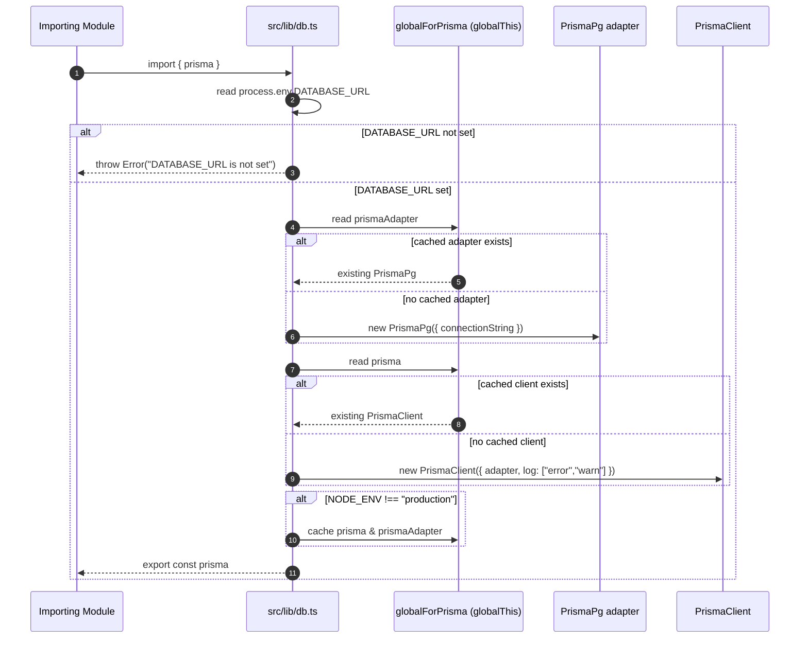

# Behavior: Prisma Client Singleton Initialization

## Context

Describes how `src/lib/db.ts` creates and reuses the shared `PrismaClient` instance across the application and across Next.js development hot reloads.

**Trigger:** Any module-level `import { prisma } from "@/lib/db"` (e.g. from `authorize()` in `src/lib/auth.ts`).

## Participants

| Participant | Type | Description |
|-------------|------|--------------|
| Importing Module | Actor | Any code that does `import { prisma } from "@/lib/db"` |
| db.ts module | Service | `src/lib/db.ts`, evaluated once per module cache |
| globalForPrisma | Service | `globalThis` cast used to persist the client across hot reloads |
| PrismaPg adapter | Service | `@prisma/adapter-pg`, wraps `DATABASE_URL` |
| PrismaClient | Service | Generated client from `@/generated/prisma/client` |

## Sequence Diagram

## Flow Description

### 1. Environment check (Step 2)

`src/lib/db.ts` reads `process.env.DATABASE_URL` at module load and throws `"DATABASE_URL is not set"` immediately if it is missing, before any client is constructed.

### 2. Adapter/client reuse (Steps 3-8)

The module casts `globalThis` to a typed `{ prisma?: PrismaClient; prismaAdapter?: PrismaPg }` shape (`globalForPrisma`) and uses the nullish-coalescing operator to reuse an existing adapter/client if one was cached on a previous module evaluation, or construct a new one otherwise.

### 3. Conditional caching (Step 9)

Only when `process.env.NODE_ENV !== "production"` does the module write the client and adapter back onto `globalForPrisma`. This is the guard against creating a new Prisma client (and new DB connections) on every Next.js dev-mode hot reload.

## Error Scenarios

| Failure Point | Handling |
|----------------|----------|
| `DATABASE_URL` unset at module load | `src/lib/db.ts` throws `new Error("DATABASE_URL is not set")`, which propagates to whatever imported the module. [NEEDS CLARIFICATION] No explicit catch/handling for this is visible in this module's inputs. |
| Database unreachable at query time | [NEEDS CLARIFICATION] Not handled in `src/lib/db.ts`; only `log: ["error", "warn"]` is configured on the client. |
