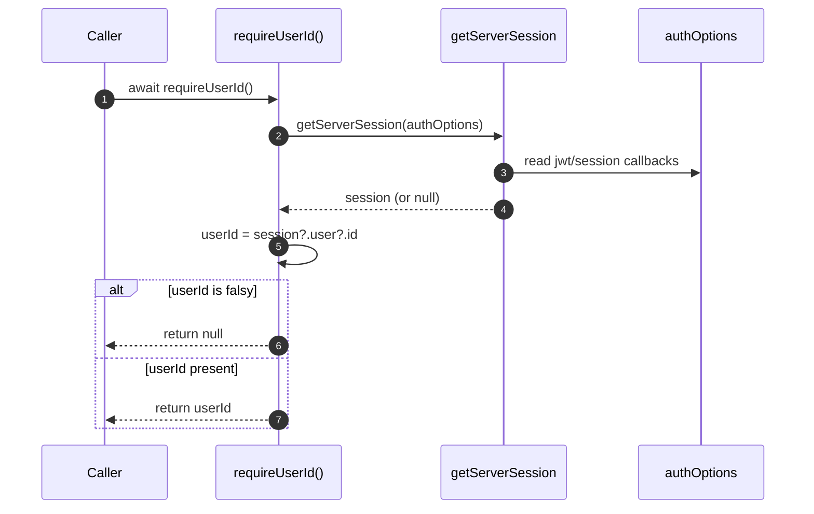

# Behavior: Session User Resolution

## Context

Describes `requireUserId()` in `src/lib/requireUser.ts`, used to resolve the current authenticated user's ID from the server-side session.

**Trigger:** A caller (e.g. an API route handler, outside this module's scope) invokes `await requireUserId()`.

## Participants

| Participant | Type | Description |
|-------------|------|--------------|
| Caller | Actor | Code invoking `requireUserId()` |
| requireUserId() | Service | `src/lib/requireUser.ts` |
| getServerSession | Service | `next-auth`'s `getServerSession` |
| authOptions | Service | `src/lib/auth.ts` configuration passed to `getServerSession` |

## Sequence Diagram

## Flow Description

### 1. Session retrieval (Steps 2-4)

`requireUserId()` calls `getServerSession(authOptions)`, delegating to NextAuth's own session/JWT decoding (whose `jwt`/`session` callbacks, defined in `src/lib/auth.ts`, place the user ID at `token.sub` and then `session.user.id`).

### 2. Null-safe extraction (Steps 5-7)

`session?.user?.id` is read with optional chaining. If falsy (no session, or a session without a user ID), the function returns `null`; otherwise it returns the ID string.

## Error Scenarios

| Failure Point | Handling |
|----------------|----------|
| No active session | `requireUserId()` returns `null`; it does not throw or redirect. [NEEDS CLARIFICATION] Enforcement (e.g. returning HTTP 401) is left to the caller, which is outside this module's inputs. |
| `getServerSession` throws | [NEEDS CLARIFICATION] No try/catch is present in `requireUserId()`; propagation is not confirmed in this module's inputs. |
