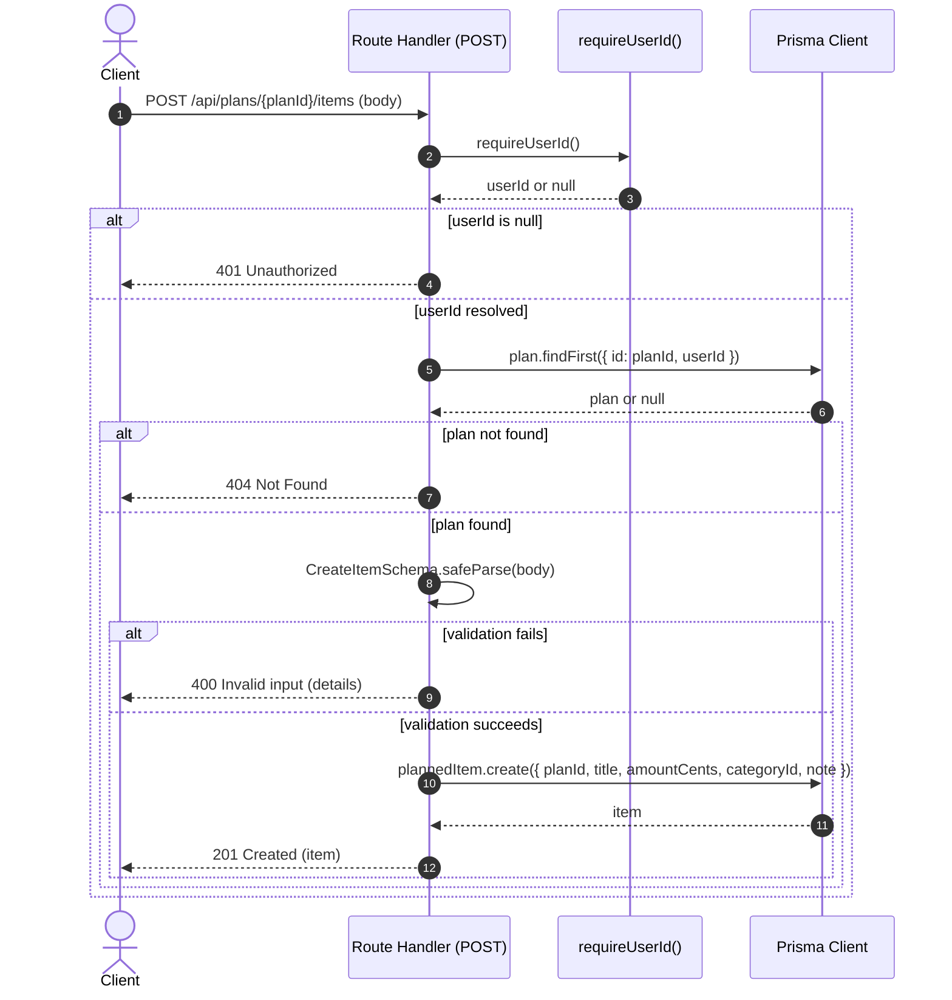

# Behavior: Create Planned Item

## Context

This sequence diagram documents the request flow triggered when a client submits `POST /api/plans/{planId}/items` to add a planned item (budget line) to an existing monthly plan, as implemented in `src/app/api/plans/[planId]/items/route.ts`.

**Trigger:** An authenticated client sends a `POST` request to `/api/plans/{planId}/items` with a JSON body describing the planned item.

---

## Participants

| Participant | Type | Description |
|-------------|------|-------------|
| Client | Actor | The authenticated caller (e.g. the web UI) submitting the new planned item |
| Route Handler | Service | The Next.js Route Handler `POST` function in `src/app/api/plans/[planId]/items/route.ts` |
| requireUserId | Service | Session/user resolution helper imported from `@/lib/requireUser` |
| Prisma Client | Service | Database client (`prisma`) imported from `@/lib/db` |

## Sequence Diagram

## Flow Description

### 1. Authentication (Steps 2-3)

The handler resolves the current user id via `requireUserId()`. If no user id is resolved, the request short-circuits with `401 Unauthorized`.

### 2. Plan ownership check (Steps 5-6)

The handler queries `prisma.plan.findFirst({ where: { id: planId, userId }, select: { id: true } })`. This both confirms the plan exists AND that it belongs to the authenticated user; if no matching plan is found, the handler returns `404 Not Found`.

### 3. Input validation (Step 7)
[NEEDS CLARIFICATION] [REVIEW] consistency: Internal inconsistency between the mermaid diagram's autonumbered steps and the Flow Description: the input-validation arrow (CreateItemSchema.safeParse) is step 8 in the diagram, but this heading labels it 'Step 7', which is actually the preceding 404 Not Found response arrow.

The JSON request body is parsed and validated against `CreateItemSchema` (Zod): `title` (string, 1-120 chars), `amountCents` (non-negative integer), `categoryId` (optional, nullable string), `note` (optional, nullable string, max 400 chars). A failed request body parse (`req.json().catch(() => null)`) is treated the same as a schema failure.

### 4. Persistence (Steps 9-11)
[NEEDS CLARIFICATION] [REVIEW] consistency: Internal inconsistency between the mermaid diagram's autonumbered steps and the Flow Description: the persistence arrows (plannedItem.create / DB response / 201 Created) are steps 10-12 in the diagram, but this heading labels them 'Steps 9-11', which incorrectly includes the unrelated step 9 (400 Invalid input response) and omits the actual final step 12 (201 Created).

On successful validation, the handler calls `prisma.plannedItem.create()` with `planId`, `title`, `amountCents`, `categoryId` (defaulted to `null`), and `note` (defaulted to `null`), then returns the created `item` with `201 Created`.

## Error Scenarios

| Failure Point | Handling |
|---------------|----------|
| No resolvable user id | `401 Unauthorized` JSON response, no DB access attempted |
| Plan does not exist or is not owned by the user | `404 Not Found` JSON response |
| Request body missing/malformed JSON | Body is coerced to `null`, which fails Zod validation, producing `400 Invalid input` |
| Request body fails `CreateItemSchema` | `400 Invalid input` with `parsed.error.flatten()` details |

[NEEDS CLARIFICATION] Behavior when `prisma.plannedItem.create()` itself throws (e.g. a foreign-key violation on an invalid `categoryId`) is not handled in the grounded code (no try/catch around the create call); confirm whether this is deliberate or an omission.
