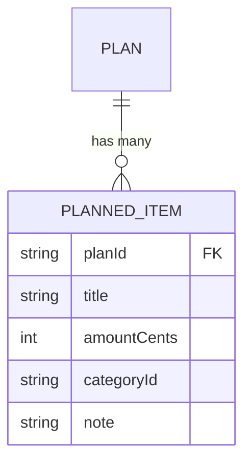

# Data Model: Planned Items

## Overview

**Database:** [NEEDS CLARIFICATION] The Prisma schema file was not present in inputs.code for this dispatch; the database engine (e.g. PostgreSQL) could not be confirmed from this module's own inputs. The `plannedItem` model is accessed through a shared Prisma client (`@/lib/db`), which per `generation.module-source-map` is owned by the persistence module.
[NEEDS CLARIFICATION] [REVIEW] consistency: This doc claims the database engine 'could not be confirmed', but the sibling persistence/data-model.md (same generated_inputs hash) directly confirms PostgreSQL from src/lib/db.ts's PrismaPg adapter - a fact grounded in an input this doc's own module also has access to (src/lib/db.ts is in this doc's code inputs).
[NEEDS CLARIFICATION] [REVIEW] completeness: The Overview claims the database engine could not be confirmed from the module's inputs, but src/lib/db.ts (listed in this dispatch's codeFiles) imports `PrismaPg` from `@prisma/adapter-pg` and uses it to construct the Prisma client, directly confirming PostgreSQL. This available input evidence was not incorporated into the section.
[NEEDS CLARIFICATION] [REVIEW] accuracy: The doc claims the database engine could not be confirmed from inputs, but `src/lib/db.ts` (an input to this dispatch, and the very file cited in this sentence) constructs the Prisma client with `new PrismaPg(...)` from `@prisma/adapter-pg`, which is Prisma's PostgreSQL adapter - directly indicating PostgreSQL rather than an unconfirmable engine.

**Schema:** [NEEDS CLARIFICATION] Not present in inputs.

## Entity-Relationship Diagram

[NEEDS CLARIFICATION] No `schema.prisma` or migration file was present in inputs.code for this module; the diagram below reflects only the fields observed being written in `src/app/api/plans/[planId]/items/route.ts` and should be confirmed against the actual schema.

## Tables

### plannedItem (Prisma model name; actual table name unconfirmed)

**Purpose:** Stores a single planned budget line item associated with a plan.

| Column | Type | Nullable | Description |
|--------|------|----------|-------------|
| id | [NEEDS CLARIFICATION] | [NEEDS CLARIFICATION] | Not written explicitly in the observed `create()` call; presumed primary key but not confirmed |
| planId | string | NO | Foreign key to the owning plan; set from the route's `planId` path parameter |
| title | string | NO | 1-120 characters (enforced by `CreateItemSchema`) |
| amountCents | integer | NO | Non-negative integer (enforced by `CreateItemSchema`) |
| categoryId | string | YES | Optional, nullable; defaults to `null` when omitted |
| note | string | YES | Optional, nullable, max 400 characters; defaults to `null` when omitted |
| created_at | [NEEDS CLARIFICATION] | [NEEDS CLARIFICATION] | Not observed in the grounded code |
[NEEDS CLARIFICATION] [REVIEW] consistency: This doc states created_at 'not observed in the grounded code', contradicting the sibling docs/modules/plans/data-model.md, which documents the same plannedItem/item table's createdAt column as a confirmed timestamp field used for ordering, grounded in code (src/app/api/plans/[planId]/route.ts) that is also among this doc's own inputs.
[NEEDS CLARIFICATION] [REVIEW] completeness: The row states the created_at column was 'not observed in the grounded code', but two other codeFiles for this dispatch (src/app/plans/[planId]/page.tsx and src/app/api/plans/[planId]/route.ts) order plannedItem records by `createdAt`, which is available evidence of the field's existence that was not incorporated.
| updated_at | [NEEDS CLARIFICATION] | [NEEDS CLARIFICATION] | Not observed in the grounded code |

**Key Indexes:**

[NEEDS CLARIFICATION] No index definitions were present in inputs.

**Foreign Keys:**

| Column | References | On Delete |
|--------|------------|-----------|
| planId | Plan.id (see [domain-model.md](../plans/domain-model.md)) | [NEEDS CLARIFICATION] |

---

## Domain Mapping

| Domain Entity | Table | Notes |
|---------------|-------|-------|
| PlannedItem | plannedItem | Direct mapping, per `prisma.plannedItem.create()` |

## Data Retention

[NEEDS CLARIFICATION] No retention or archival policy was present in inputs.code or inputs.references for this module.
