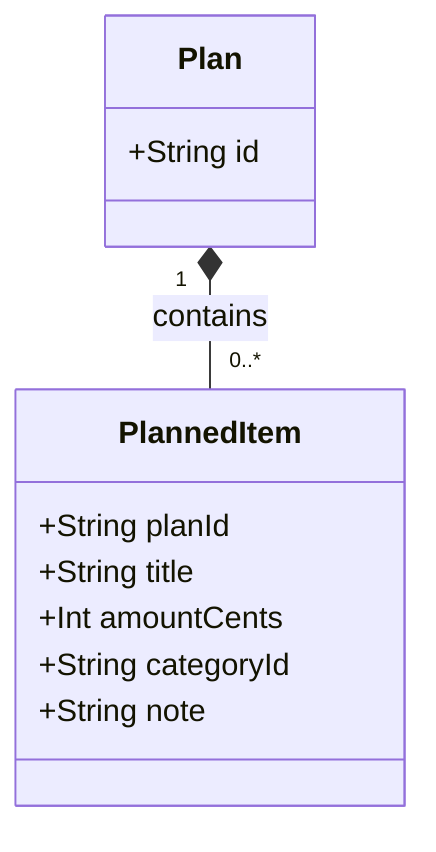

# Domain Model: Planned Items

## Overview

The Planned Items module's domain centers on a single entity, `PlannedItem`: a budget line item that belongs to exactly one `Plan`. This is grounded in `src/app/api/plans/[planId]/items/route.ts`, the only code available to this dispatch, which creates `plannedItem` records scoped to a `planId`.

## Class Diagram

`PlannedItem.id` and `createdAt` are confirmed fields: `id` is referenced directly in code (`key={it.id}` in `src/app/plans/[planId]/page.tsx`), and items are ordered by `createdAt` in both `src/app/plans/[planId]/page.tsx` and `src/app/api/plans/[planId]/route.ts` (`orderBy: { createdAt: "asc" } }`). Their exact Prisma column types were not established, as no Prisma schema was present in this module's inputs.
`PlannedItem.id` is confirmed to exist: it is referenced directly in code (`key={it.id}` in `src/app/plans/[planId]/page.tsx`), consistent with the sibling plans module doc's treatment of the same cross-module entity's `id` attribute as confirmed. Its exact type remains unestablished, as no Prisma schema was present in this module's inputs.
[NEEDS CLARIFICATION] [REVIEW] completeness: The Key Attributes table and class diagram omit `id` and `createdAt`, and this line claims they are 'presumed but not confirmed' with no Prisma schema available, but other codeFiles in this dispatch (plans/[planId]/page.tsx and api/plans/[planId]/route.ts) already reference `it.id` and order items by `createdAt`, evidencing both fields. The Entities section is incomplete because it does not capture this input-evident attribute.

## Entities

### Plan (referenced, owned by the plans module)

**Purpose:** The monthly plan that a `PlannedItem` belongs to. Full definition: see [domain-model.md](../plans/domain-model.md).

**Relationships:**

- Contains 0..* `PlannedItem`

---

### PlannedItem
This document names the entity `PlannedItem`, matching the `prisma.plannedItem` model referenced in code (`prisma.plannedItem.create(...)` in `src/app/api/plans/[planId]/items/route.ts`); the sibling plans module doc's use of `Item` refers to the same underlying entity under an alternate name used for its cross-module reference.

**Purpose:** A single budgeted line item (e.g. an expense) within a plan.

**Key Attributes:**

| Attribute | Type | Description |
|-----------|------|-------------|
| planId | String | Identifies the owning `Plan`; supplied from the route path parameter |
| title | String | 1-120 characters, required |
| amountCents | Integer | Non-negative integer, required; money stored in integer cents |
| categoryId | String (nullable) | Optional link to a category; [NEEDS CLARIFICATION] no `Category` entity/module was present in inputs to confirm its structure or ownership |
| note | String (nullable) | Optional free-text note, max 400 characters |

**Invariants (rules that must always hold):**

- `title` must be between 1 and 120 characters.
- `amountCents` must be a non-negative integer.
- `note`, when present, must not exceed 400 characters.
- A `PlannedItem` can only be created under a `Plan` that exists and belongs to the authenticated user (enforced by the `prisma.plan.findFirst({ id: planId, userId })` check).

**Relationships:**

- Belongs to exactly one `Plan` (via `planId`).
- Optionally references a category (via `categoryId`); [NEEDS CLARIFICATION] category entity not confirmed.

## Value Objects

No dedicated value-object types were found in this module's grounded code: `amountCents` is passed and validated as a plain `Int` (`z.number().int().min(0)` in `src/app/api/plans/[planId]/items/route.ts`), and currency formatting is performed by the caller (e.g. `(it.amountCents / 100).toFixed(2)` in `src/app/plans/[planId]/page.tsx`) rather than by a dedicated `Money` or similar value-object wrapper.

## Domain Events

No domain event emission was observed: the `POST` handler in `src/app/api/plans/[planId]/items/route.ts` creates a `plannedItem` record via `prisma.plannedItem.create(...)` and returns the created item directly in the HTTP response, with no event bus, message queue, or outbox write present in the grounded code.
