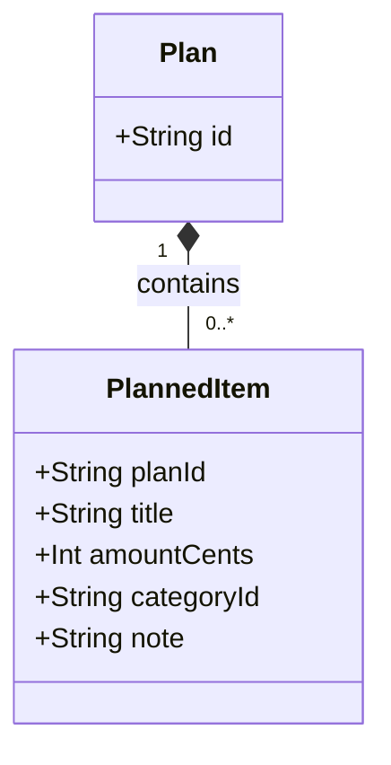

# Domain Model: Planned Items

## Overview

The Planned Items module's domain centers on a single entity, `PlannedItem`: a budget line item that belongs to exactly one `Plan`. This is grounded in `src/app/api/plans/[planId]/items/route.ts`, the only code available to this dispatch, which creates `plannedItem` records scoped to a `planId`.

## Class Diagram

[NEEDS CLARIFICATION] `PlannedItem.id` and timestamp fields are presumed but not confirmed; no Prisma schema was present in this module's inputs.
[NEEDS CLARIFICATION] [REVIEW] consistency: This document treats the existence of an `id` field on the entity as unconfirmed/presumed, while the sibling plans module doc (docs/modules/plans/domain-model.md) lists `id` as a confirmed attribute of the same cross-module entity (only its type is flagged as unconfirmed there).
[NEEDS CLARIFICATION] [REVIEW] completeness: The Key Attributes table and class diagram omit `id` and `createdAt`, and this line claims they are 'presumed but not confirmed' with no Prisma schema available, but other codeFiles in this dispatch (plans/[planId]/page.tsx and api/plans/[planId]/route.ts) already reference `it.id` and order items by `createdAt`, evidencing both fields. The Entities section is incomplete because it does not capture this input-evident attribute.

## Entities

### Plan (referenced, owned by the plans module)

**Purpose:** The monthly plan that a `PlannedItem` belongs to. Full definition: see [domain-model.md](../plans/domain-model.md).

**Relationships:**

- Contains 0..* `PlannedItem`

---

### PlannedItem
[NEEDS CLARIFICATION] [REVIEW] consistency: This document names the entity `PlannedItem` (matching the `prisma.plannedItem` model), but the linked plans module doc (docs/modules/plans/domain-model.md) names the identical cross-module entity `Item` throughout its class diagram and Entities table. The two docs disagree on the entity's name.

**Purpose:** A single budgeted line item (e.g. an expense) within a plan.

**Key Attributes:**

| Attribute | Type | Description |
|-----------|------|-------------|
| planId | String | Identifies the owning `Plan`; supplied from the route path parameter |
| title | String | 1-120 characters, required |
| amountCents | Integer | Non-negative integer, required; money stored in integer cents |
| categoryId | String (nullable) | Optional link to a category; [NEEDS CLARIFICATION] no `Category` entity/module was present in inputs to confirm its structure or ownership |
| note | String (nullable) | Optional free-text note, max 400 characters |

**Invariants (rules that must always hold):**

- `title` must be between 1 and 120 characters.
- `amountCents` must be a non-negative integer.
- `note`, when present, must not exceed 400 characters.
- A `PlannedItem` can only be created under a `Plan` that exists and belongs to the authenticated user (enforced by the `prisma.plan.findFirst({ id: planId, userId })` check).

**Relationships:**

- Belongs to exactly one `Plan` (via `planId`).
- Optionally references a category (via `categoryId`); [NEEDS CLARIFICATION] category entity not confirmed.

## Value Objects

[NEEDS CLARIFICATION] No value objects distinct from `PlannedItem`'s own scalar fields were evidenced in the grounded code.

## Domain Events

[NEEDS CLARIFICATION] No domain event emission (e.g. an event bus or outbox) was observed in the grounded route handler.
