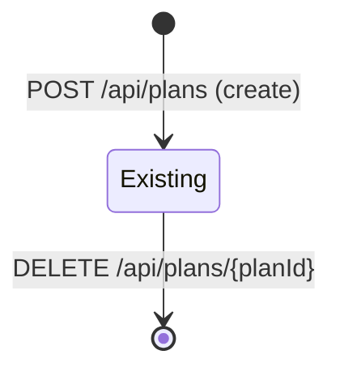

# Plan Lifecycle

## _template.md

<!-- SLOT:content brief="Document content (_template.md)" -->
### Context

This document describes the lifecycle of a `Plan` entity as observed across `src/app/api/plans/route.ts` and `src/app/api/plans/[planId]/route.ts`. A plan represents one user's monthly financial plan.

**Trigger:** A plan enters existence when the user submits the "Create new plan" form (`NewPlanForm.tsx`), which calls `POST /api/plans`. It leaves existence when the user clicks "Delete plan" (`DeletePlanButton.tsx`), which calls `DELETE /api/plans/{planId}`.

### Entity Reference

**Entity:** Plan
**Defined in:** [data-model.md](../data-model.md), [domain-model.md](../domain-model.md)

### State Diagram

The code does not expose an explicit status/state field on the plan (no enum or status column is read or written by any of the manifest's route handlers). The observed lifecycle is therefore existence-based rather than a multi-state machine:

### States

#### Existing

**Meaning:** A row exists in the plans store for `(userId, year, month)`. The row can accumulate items (managed by the planned-items module) and be read via `GET /api/plans` or `GET /api/plans/{planId}`.

**Entry:** `POST /api/plans` succeeds. Uniqueness is enforced per `(userId, year, month)`: a second create attempt for the same user/year/month returns `409 Plan for this month already exists` (see `src/app/api/plans/route.ts`, `POST` handler, catch block).

**Allowed Actions:**
- Read via `GET /api/plans` or `GET /api/plans/{planId}` (`src/app/api/plans/[planId]/route.ts`)
- Item additions via the planned-items module (`AddItemForm.tsx` posts to `/api/plans/{planId}/items`, outside this module's scope)
- Delete via `DELETE /api/plans/{planId}`

**Exit:** `DELETE /api/plans/{planId}` succeeds, after an ownership check (`findFirst({ where: { id: planId, userId } })`).

[NEEDS CLARIFICATION] There is no observed "update" endpoint (no `PUT`/`PATCH` handler in `src/app/api/plans/[planId]/route.ts`) for editing an existing plan's title, year, month, or currency after creation; please confirm whether edit is intentionally unsupported or out of scope for this manifest.

### Transition Matrix

| From | To | Trigger | Conditions |
|------|-----|---------|------------|
| [*] | Existing | `POST /api/plans` | Zod validation passes; `(userId, year, month)` not already taken |
| Existing | [*] | `DELETE /api/plans/{planId}` | Plan found for `(id, userId)` |

### Events Emitted

[NEEDS CLARIFICATION] No domain event emission (message bus, webhook, or similar) is present in `src/app/api/plans/route.ts` or `src/app/api/plans/[planId]/route.ts`.
<!-- /SLOT:content -->
