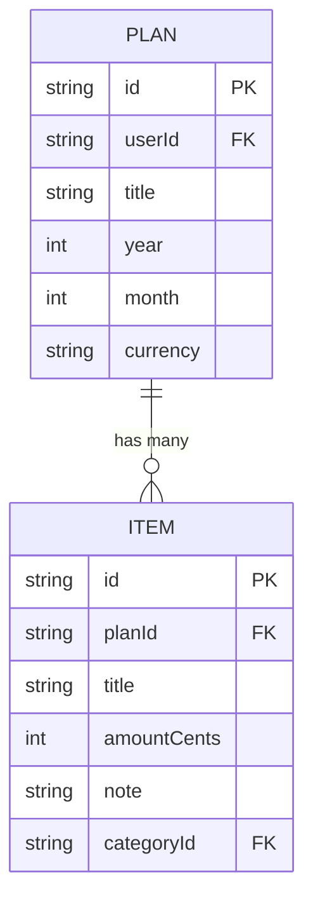

# Data Model

## data-model.md

<!-- SLOT:content brief="Document content (data-model.md)" -->
### Overview

**Database:** Accessed through a shared Prisma client (`prisma` imported from `@/lib/db`, part of the persistence module, out of scope for this document). The manifest for the plans module does not include the Prisma schema file, so the exact SQL type/database engine cannot be confirmed here.

**Schema:** [NEEDS CLARIFICATION] No `schema.prisma` file was present in inputs.code for the plans module; column types below are inferred only from field usage in `src/app/api/plans/route.ts` and `src/app/api/plans/[planId]/route.ts`, not from a schema declaration.

### Entity-Relationship Diagram

### Tables

#### plan (inferred model name: `Plan`)

**Purpose:** Stores one monthly financial plan per user per (year, month).

| Column | Type | Nullable | Description |
|--------|------|----------|--------------|
| id | string | NO | Primary key, referenced as `plan.id` / `planId` string values in route handlers |
| userId | string | NO | Owner of the plan; used in every `where` clause (`src/app/api/plans/route.ts`, `src/app/api/plans/[planId]/route.ts`) to scope reads/writes to the authenticated user |
| title | string | YES (server defaults to `${month}.${year}` when omitted, per `CreatePlanSchema` in `src/app/api/plans/route.ts`) | Display title, 1-80 chars when supplied |
| year | int | NO | 2000-2100, validated by Zod |
| month | int | NO | 1-12, validated by Zod |
| currency | string | NO | Exactly 3 characters; defaults to `"CZK"` when omitted |
| createdAt | [NEEDS CLARIFICATION] | - | Not read/written directly on `Plan` in the manifest files; only `items.createdAt` is used for ordering |

**Key Indexes:**

| Columns | Purpose |
|---------|---------|
| (userId, year, month) | [NEEDS CLARIFICATION - inferred] A unique constraint on this triple is implied by the `POST /api/plans` handler catching a create failure and responding `409 Plan for this month already exists` (code comment: "unikát (userId, year, month)"), but the actual index/constraint definition is not present in this module's inputs. |

**Foreign Keys:**

| Column | References | On Delete |
|--------|------------|-----------|
| userId | User (auth module) | [NEEDS CLARIFICATION] Not established by this module's inputs |

---

#### item (related entity, owned by the planned-items module)

Referenced here only because `GET /api/plans/{planId}` includes it (`include: { items: { orderBy: { createdAt: "asc" } } }`) and `plan/page.tsx` reduces over `plan.items`.

| Column | Type | Nullable | Description |
|--------|------|----------|--------------|
| id | [NEEDS CLARIFICATION] | NO | Primary key |
| planId | string | NO | Foreign key back to Plan |
| title | string | NO | Required in `AddItemForm.tsx` |
| amountCents | int | NO | Integer cents, computed client-side by `AddItemForm.tsx`'s `toCents()` helper |
| note | string | YES | Optional free text |
| categoryId | string | YES | Always sent as `null` by `AddItemForm.tsx`; no category selection UI observed in this module |
| createdAt | timestamp | NO | Used to order items ascending |

Full column definitions for `item` belong to the planned-items module's data-model.md; this table is included only for the relationship it has to `Plan`.

### Domain Mapping

| Domain Entity | Table | Notes |
|---------------|-------|-------|
| Plan | plan | Aggregate root for this module; see [domain-model.md](domain-model.md) |
| Item | item | Owned by the planned-items module; related via `planId` |

### Data Retention

[NEEDS CLARIFICATION] No retention policy, archival strategy, or soft-delete flag was observed; `DELETE /api/plans/{planId}` performs a hard `prisma.plan.delete`.
<!-- /SLOT:content -->
