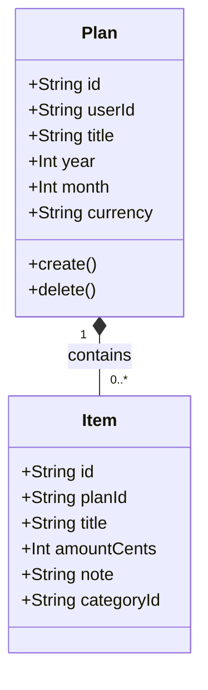

# Domain Model

## domain-model.md

<!-- SLOT:content brief="Document content (domain-model.md)" -->
### Overview

The plans module centers on a single aggregate root, `Plan`, representing one user's budget for a given calendar month. Each plan is scoped to exactly one user and, per the create-route's conflict handling, to exactly one `(year, month)` pair for that user. A plan relates to zero or more `Item` records (owned by the planned-items module) that make up its content.

### Class Diagram

### Entities

#### Plan (Aggregate Root)

**Purpose:** Represents a user's financial plan for one calendar month, used as the scope under which items are tracked.

**Key Attributes:**

| Attribute | Type | Description |
|-----------|------|--------------|
| id | [NEEDS CLARIFICATION - type not established] | Unique identifier, referenced as `planId` in route params |
| userId | [NEEDS CLARIFICATION - type not established] | Owner; every query filters on this field (`src/app/api/plans/route.ts`, `src/app/api/plans/[planId]/route.ts`) |
| title | string | 1-80 chars if supplied; defaults to `${month}.${year}` (`POST /api/plans` handler) |
| year | int | 2000-2100, validated by Zod (`CreatePlanSchema`) |
| month | int | 1-12, validated by Zod |
| currency | string | Exactly 3 characters; defaults to `"CZK"` |

**Invariants (rules that must always hold):**

- A plan always belongs to exactly one `userId` and is never returned or mutated for a different user (every handler filters by `{ id: planId, userId }` or `{ userId }`).
- `year` is within `[2000, 2100]` and `month` within `[1, 12]` (Zod schema constraints).
- `currency` is exactly 3 characters (Zod schema constraint; note the client UI in `NewPlanForm.tsx` only offers `CZK`, `EUR`, `USD` via a `<select>`, but the server-side schema does not restrict to that set - it accepts any 3-character string).
- `(userId, year, month)` is treated as unique: a second create for the same user/year/month is rejected with `409` (`POST /api/plans` handler catch block, code comment "unikát (userId, year, month)").

**Relationships:**

- Contains 0..* `Item` (via `GET /api/plans/{planId}`'s `include: { items: ... }` and `plan/page.tsx`'s summation over `plan.items`)

---

#### Item (related entity, owned by the planned-items module)

**Purpose:** A single budget line within a plan (title, amount, optional note/category). Full domain rules for Item belong to the planned-items module's own domain-model.md; documented here only for the relationship to Plan.

**Parent:** Plan

**Key Attributes:**

| Attribute | Type | Description |
|-----------|------|--------------|
| id | [NEEDS CLARIFICATION - type not established] | Unique identifier |
| title | string | Required (`AddItemForm.tsx`) |
| amountCents | int | Integer cents; the client computes this via a regex-validated parse (`AddItemForm.tsx`'s `toCents()`), rejecting inputs that are not `\d+(\.\d{1,2})?` |
| note | string \| null | Optional |
| categoryId | null | Always submitted as `null` by `AddItemForm.tsx`; no category-selection UI exists in this module |

**Lifecycle:**
- Created when: the user submits `AddItemForm.tsx` (`POST /api/plans/{planId}/items`, implemented outside this module)
- Deleted when: never directly - no dedicated `DELETE` endpoint exists for individual items; items are removed only as a side effect of deleting their parent plan via `DELETE /api/plans/{planId}` (`src/app/api/plans/[planId]/route.ts`, triggered from the UI by `DeletePlanButton.tsx`), which calls `prisma.plan.delete({ where: { id: planId } })` - whether this cascades to delete the plan's items depends on the Prisma schema's relation configuration, which is not included among this module's inputs

### Value Objects

No dedicated value-object types (e.g., a `Money` or `MonthYear` wrapper class) were found in the plans module's files; amounts and year/month are passed as plain `Int`/`String` values, with the cents conversion done inline in `AddItemForm.tsx`'s `toCents()` function and validated server-side via `z.number().int()` in `CreateItemSchema` (`items/route.ts`) and `CreatePlanSchema` (`plans/route.ts`).

### Domain Events

No domain event emission was observed in `src/app/api/plans/route.ts`, `src/app/api/plans/[planId]/route.ts`, or `src/app/api/plans/[planId]/items/route.ts` - all three route handlers perform direct Prisma CRUD calls (`prisma.plan.create`/`delete`/`findFirst`/`findMany`, `prisma.plannedItem.create`) with no event bus, pub/sub, or webhook dispatch.
<!-- /SLOT:content -->
