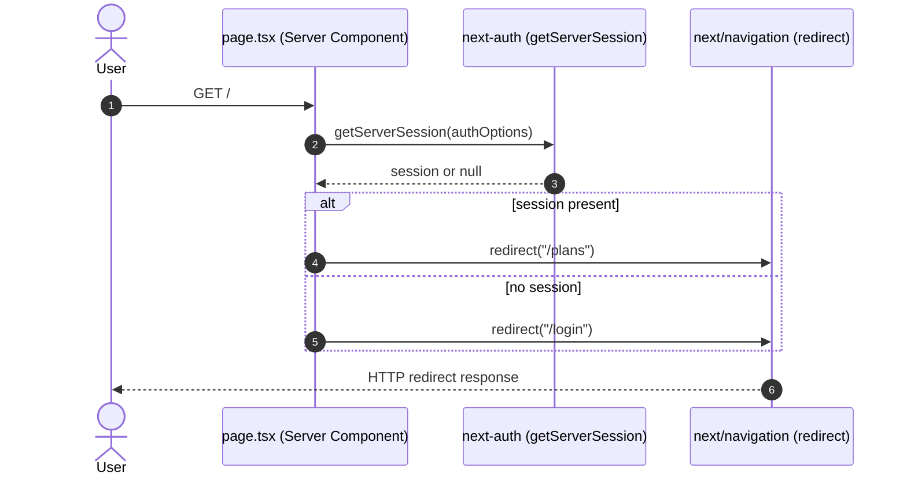

# Server Client Rendering

## _template.md

<!-- SLOT:content brief="Document content (_template.md)" -->
# Behavior: Server/Client Rendering at the Root Route

## Context

This diagram documents the server-side rendering flow of the finance-planner root route (`/`), implemented by the Next.js App Router Server Component `src/app/page.tsx`. It shows how a request to `/` is resolved entirely on the server, before any client-side rendering, by branching on the current authentication session.

**Trigger:** An HTTP GET request to `/` (the application root).

---

## Participants

| Participant | Type | Description |
|-------------|------|-------------|
| User | Actor | Browser issuing the `GET /` request |
| page.tsx | Service | `HomePage`, the `async` Server Component default-exported from `src/app/page.tsx` |
| getServerSession | Service | Function imported from `next-auth`, called with `authOptions` from `@/lib/auth` |
| redirect | Service | Function imported from `next/navigation`, used to issue the HTTP redirect |

## Sequence Diagram

## Flow Description

### 1. Session Resolution (Step 1-2)

`HomePage` in `src/app/page.tsx` is an `async` Server Component. On each request to `/`, it calls `getServerSession(authOptions)`, where `authOptions` is imported from `@/lib/auth`. This call executes entirely on the server; no session-check code ships to the client bundle for this route.

### 2. Conditional Redirect (Step 3-4)

Based on the truthiness of the returned `session`, the component calls `redirect(session ? "/plans" : "/login")` from `next/navigation`. Next.js converts this into an HTTP redirect response; the root route itself never renders a response body of its own.

Neither `src/app/layout.tsx` nor `src/app/page.tsx` contains a `"use client"` directive, so both render as Server Components — no client-side rendering occurs in this observed flow. Client components do exist under both destination routes: `/login` renders `src/app/login/LoginClient.tsx` (marked `"use client"`) via the server component `src/app/login/page.tsx`, and `/plans` renders `src/app/plans/NewPlanForm.tsx` (marked `"use client"`) alongside the server-rendered `src/app/plans/page.tsx`. `src/app/plans/[planId]/page.tsx` similarly composes the client components `AddItemForm.tsx` and `DeletePlanButton.tsx`, and `/register` renders the client component `src/app/register/page.tsx`.
[NEEDS CLARIFICATION] [REVIEW] completeness: This behavior doc is titled 'Server Client Rendering' but covers only the trivial root-route redirect and disclaims client-side rendering as 'outside the web-ui module's manifest scope'. That claim is contradicted by the dispatch's own codeFiles, which include five 'use client' components (LoginClient.tsx, register/page.tsx, NewPlanForm.tsx, AddItemForm.tsx, DeletePlanButton.tsx) squarely inside the web-ui module. The document omits any discussion of the client-side rendering half of its own title despite that material being available in its inputs.
Client components do exist under both destination routes: `src/app/login/LoginClient.tsx` (rendered via `/login`) and `src/app/plans/NewPlanForm.tsx` (rendered via `/plans`) both begin with the `"use client"` directive, confirming that client-side rendering occurs beyond the root route within this module's own code inputs.

## Error Scenarios

| Failure Point | Handling |
|---------------|----------|
| `getServerSession(authOptions)` throws or rejects | [NEEDS CLARIFICATION] No `try`/`catch` or error boundary around this call is present in `src/app/page.tsx`; behavior on failure is not evidenced in the reviewed code. |
| `authOptions` misconfiguration | `authOptions` (defined in `src/lib/auth.ts`, the auth configuration module — not the persistence module, which is `src/lib/db.ts`) uses a JWT session strategy and a `CredentialsProvider` whose `authorize` callback returns `null` on missing or invalid credentials rather than throwing. No explicit handling for a malformed `authOptions` object itself is implemented in `src/lib/auth.ts`; such misconfiguration would surface as a NextAuth initialization or runtime error rather than an application-level catch. |
[NEEDS CLARIFICATION] [REVIEW] completeness: The Error Scenarios row claims authOptions content 'was not reviewed here' because it is 'outside this dispatch's web-ui manifest scope', but src/lib/auth.ts is directly listed in this document's own codeFiles input and defines authOptions in full (credentials provider, jwt/session callbacks, signIn page). The document leaves this error scenario unaddressed despite the source being available to it.
`authOptions` is defined in `src/lib/auth.ts`, the auth configuration module (not the persistence module — `src/lib/db.ts` is the Prisma client used for persistence), and its full content is included in this document's own inputs. It configures a JWT session strategy and a `CredentialsProvider` whose `authorize` callback verifies credentials via `bcrypt.compare` against `prisma.user.findUnique`, returning `null` on failure, with `pages.signIn` set to `"/login"`. No explicit handling for a malformed `authOptions` object itself is implemented in `src/lib/auth.ts`; such misconfiguration would surface as a NextAuth initialization or runtime error rather than an application-level catch.
<!-- /SLOT:content -->
