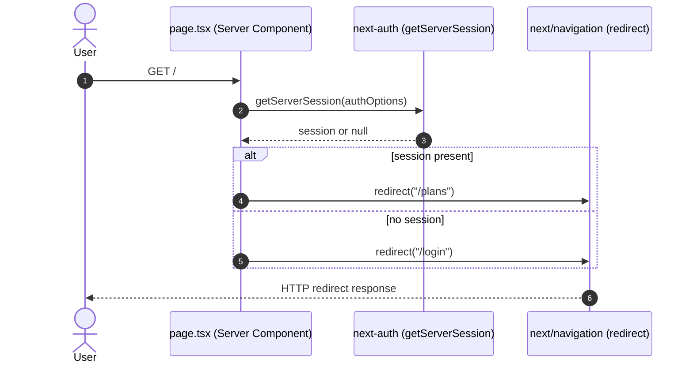

# Server Client Rendering

## _template.md

<!-- SLOT:content brief="Document content (_template.md)" -->
# Behavior: Server/Client Rendering at the Root Route

## Context

This diagram documents the server-side rendering flow of the finance-planner root route (`/`), implemented by the Next.js App Router Server Component `src/app/page.tsx`. It shows how a request to `/` is resolved entirely on the server, before any client-side rendering, by branching on the current authentication session.

**Trigger:** An HTTP GET request to `/` (the application root).

---

## Participants

| Participant | Type | Description |
|-------------|------|-------------|
| User | Actor | Browser issuing the `GET /` request |
| page.tsx | Service | `HomePage`, the `async` Server Component default-exported from `src/app/page.tsx` |
| getServerSession | Service | Function imported from `next-auth`, called with `authOptions` from `@/lib/auth` |
| redirect | Service | Function imported from `next/navigation`, used to issue the HTTP redirect |

## Sequence Diagram

## Flow Description

### 1. Session Resolution (Step 1-2)

`HomePage` in `src/app/page.tsx` is an `async` Server Component. On each request to `/`, it calls `getServerSession(authOptions)`, where `authOptions` is imported from `@/lib/auth`. This call executes entirely on the server; no session-check code ships to the client bundle for this route.

### 2. Conditional Redirect (Step 3-4)

Based on the truthiness of the returned `session`, the component calls `redirect(session ? "/plans" : "/login")` from `next/navigation`. Next.js converts this into an HTTP redirect response; the root route itself never renders a response body of its own.

Neither `src/app/layout.tsx` nor `src/app/page.tsx` contains a `"use client"` directive, so both render as Server Components — no client-side rendering occurs in this observed flow. [NEEDS CLARIFICATION] Whether client components exist under the destination routes (`/plans`, `/login`) is outside the web-ui module's manifest scope reviewed for this document.

## Error Scenarios

| Failure Point | Handling |
|---------------|----------|
| `getServerSession(authOptions)` throws or rejects | [NEEDS CLARIFICATION] No `try`/`catch` or error boundary around this call is present in `src/app/page.tsx`; behavior on failure is not evidenced in the reviewed code. |
| `authOptions` misconfiguration | [NEEDS CLARIFICATION] `authOptions` is defined in the persistence module (`src/lib`, via `@/lib/auth`), which is outside this dispatch's web-ui manifest scope; its content was not reviewed here. |
<!-- /SLOT:content -->
