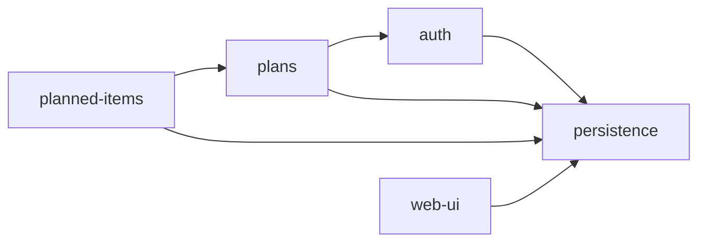

# Overview

## overview.md

<!-- SLOT:content brief="Document content (overview.md)" -->
### System Context

finance-planner is a personal monthly financial planning web application built on the Next.js App Router. Per the module overviews, an authenticated user registers and signs in (auth module), then creates and manages per-month financial plans (plans module) that contain budgeted line items - "planned items" (planned-items module) with amounts stored as `amountCents`. All request handling and page rendering runs inside a single Next.js application (the web-ui module owns the root shell and root-route redirect).

[NEEDS CLARIFICATION] `README.md` is generic Next.js `create-next-app` boilerplate and contains no finance-planner-specific business description (target users, organization, or regulatory context). No other reference documents were supplied to this dispatch, so the broader business rationale for the system is unconfirmed.

### Module Map

The system is organized into five modules (per `doc_struc.md`'s `generation.module-source-map` and the corresponding module overview docs):

| Module | Source paths | Purpose |
|--------|--------------|---------|
| [auth](modules/auth/overview.md) | `src/app/api/auth`, `src/app/login`, `src/app/register`, `src/app/logout`, `src/types` | Account registration and NextAuth credentials-based sign-in; issues the session that gates access to a user's own plans. |
| [plans](modules/plans/overview.md) | `src/app/api/plans`, `src/app/plans` | Create, list, view, and delete a user's monthly financial plans. |
| [planned-items](modules/planned-items/overview.md) | `src/app/api/plans/[planId]/items` | Create budget line items (`title`, `amountCents`, optional `categoryId`/`note`) scoped to a plan owned by the authenticated user. |
| [persistence](modules/persistence/overview.md) | `src/lib` | Shared PostgreSQL-backed Prisma client, NextAuth `authOptions` configuration, and the `requireUserId()` session helper. |
| [web-ui](modules/web-ui/overview.md) | `src/app` (root layout/page/CSS) | Root HTML layout, global CSS theme, and a session-aware root-route (`/`) redirect to `/plans` or `/login`. |

Cross-module dependency edges, as declared in each module's own "Dependencies" section:

- `auth` depends on `persistence` for user lookup (`prisma.user.findUnique`) and creation (`prisma.user.create`) during registration.
- `plans` depends on `auth` (`requireUserId()` / `getServerSession(authOptions)`) and on `persistence` (the shared Prisma client) for all plan CRUD.
- `planned-items` depends on `persistence` (shared Prisma client) and on `plans` (a planned item cannot be created without an existing plan owned by the same user, enforced via `prisma.plan.findFirst`).
- `web-ui` depends on `persistence` because `src/app/page.tsx` imports `authOptions` from `@/lib/auth` to call `getServerSession(authOptions)`.
- `persistence` itself declares no internal cross-module imports in its own overview.

[NEEDS CLARIFICATION] No build manifest (e.g. `package.json`) was present in this dispatch's inputs, so external package dependencies (`next-auth`, `bcryptjs`, `zod`, `@prisma/adapter-pg`, etc.) referenced across the module overviews could not be cross-confirmed against a manifest per the dependency-grounding rule.

### Deployment Overview

`README.md`'s "Deploy on Vercel" section is unmodified `create-next-app` boilerplate text ("The easiest way to deploy your Next.js app is to use the Vercel Platform") and does not confirm that finance-planner is actually deployed on Vercel or describe any project-specific hosting configuration.

The [persistence overview](modules/persistence/overview.md) notes that `src/lib/db.ts` fails fast at module load if the `DATABASE_URL` environment variable is not set, and that the Prisma client is bound to PostgreSQL through a `PrismaPg` adapter - so the application requires a reachable PostgreSQL database at runtime.

[NEEDS CLARIFICATION] The actual hosting environment, database hosting provider, and any deployment/CI configuration are not confirmed by this dispatch's inputs (`README.md` and the five module overview docs).

### Key Characteristics

- **Architectural style:** a Next.js App Router monolith - a single deployable application combining API route handlers (`src/app/api/**`) and server-rendered pages/forms (`src/app/**`), per the consistent file-path references across all five module overviews.
- **Authentication:** NextAuth `CredentialsProvider`, JWT-strategy session, with `jwt`/`session` callbacks that propagate the user ID onto the session (per [persistence/overview.md](modules/persistence/overview.md)).
- **Data access:** a single shared `PrismaClient`, cached across Next.js hot reloads via a `globalThis` cache, used by every module that touches the database (per [persistence/overview.md](modules/persistence/overview.md)).
- **Request validation:** Zod schemas at the request boundary, used by the auth (registration), plans (plan creation), and planned-items (item creation) modules per their respective overview docs.
- **Money representation:** planned items store amounts as `amountCents` (per [planned-items/overview.md](modules/planned-items/overview.md)), indicating an integer-cents monetary representation rather than floating-point currency values.
- **Currency:** plans default to `CZK` when no currency is supplied at creation (per [plans/overview.md](modules/plans/overview.md)).

[NEEDS CLARIFICATION] Whether the system is a monolith by deliberate architectural choice versus incidental (e.g. no separate service boundaries observed) is not addressed by any reference document in this dispatch's inputs.
<!-- /SLOT:content -->
